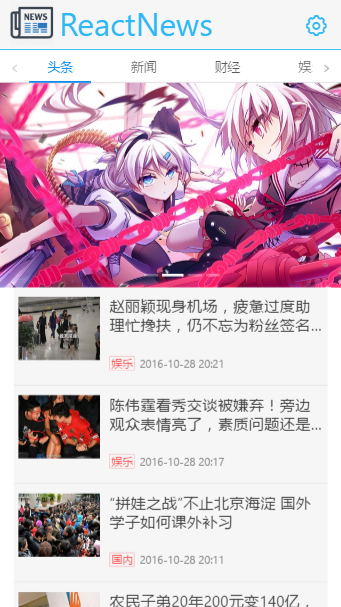
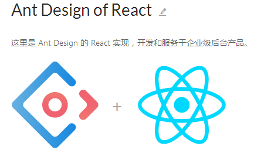

# React-news


>一个基于 React + Webpack + es6 + Babel + ant-design 的新闻站点  

项目主页 [Github-react_news_site](https://github.com/cjxmg/react_news_site)

演示地址 [ReactNews](http://superxmg.website/project/react_news_site/)

## 写在前面
之前自学过前端自动化工具和angular，但一直没有搭建过一个完整的项目，于是这次认真的做了个基于react新闻网站，自动化工具采用webpack，由于使用了es6的语法，需要用到Babel，Babel是一个广泛使用的转码器，可以将ES6代码转为ES5代码。

此项目是根据慕课网教程仿制的，通过此项目也确实学到了很多东西，现在分享出来，也算是我的一个学习总结，[完整的视频教程链接](http://pan.baidu.com/s/1nuVL3hJ)

觉得好的同学可以给个**star**，万分感谢~ (✪ω✪)

## 效果图
适配了移动端，pc端直接打开上面的链接

移动端 预览  |  直接扫码打开网页
:-:|:-:
 | 

## 运行项目

**安装依赖**  
```shell
npm install
```
**进入开发模式**
```shell
npm run dev
// or
webpack-dev-server --inline --hot
// 之后打开 localhost:8080 查看
```
如果还没安装node的同学，可把 index.html 里的 script 改成下面的形式，然后直接打开`index.html`即可


## [webpack](http://webpack.github.io/docs/)配置

> webpack是一款模块加载器兼打包 工具，它能把各种资源，例如JS（含JSX）、coffee、样式（含less/sass）、图片等都作为模块来使用和处理。

 react的组件功能很好用，在一个项目中，有些组件可能由不同的人所开发，所以时常需要引入其他的脚本文件，虽然可以用命名空间的办法来解决，但最后在html页面中通过script标签引入各类组件和文件时，还是会显着异常混乱，各模块之间的依赖，先后加载顺序都得人为控制，会极大的降低开发效率，而且项目中用到了es6的语法，需要用到babel来进行es6的转化，所以选择了webpack来进行前端自动化的管理

 webpack配置文件：webpack.config.js

 ```javascript
 module.exports = {
   entry: __dirname + '/src/js/root.js',
   output: {
     path: __dirname + '/src/',
     filename: 'bundle.js'
   },
   module: {
     loaders: [
       {
         test: /\.js?$/,
         exclude: /node_modules/,
         loader: 'babel-loader',
         query: {
           presets: ['react', 'es2015 '], //设定babel的转码规则
           "plugins": [
             ["import", { libraryName: "antd", "style": "css" }] // `style: true` 会加载 less 文件
           ]
         }
       },
       {
         test: /\.css$/,
         loader: 'style!css-loader'
       }
     ]
   }
 }
 ```
当运行`webpack`命令时会自动把文件打包在./src目录下


## [ANT DESIGN](https://ant.design/index-cn)



> 一个 UI 设计框架，采用 React 封装的一套 Ant Design 的组件库，比较好用，可快速构建一个样式丰富的站点

antd的组件使用十分方便，官方文档也比较详细
```javascript
import 'antd/dist/antd.css';  // or 'antd/dist/antd.less'
import { DatePicker } from 'antd';
ReactDOM.render(<DatePicker />, mountNode);  //也可传入参数
```
如果只需要用到其中的几个组件，则引入全部antd的样式则会显得多余，官方文档推荐了一个package： `babel-plugin-import`，配置使用后只需引入组件就行，不用理会样式，`babel-plugin-import`会自动按需加载需要的样式，而忽略那些多余的样式
```javascript
// babel-plugin-import 会帮助你加载 JS 和 CSS
import { DatePicker } from 'antd';
```
## React + Es6
> 用es6的语法写react组件会有一些不同，比如。。

#### 组件的定义
* es5语法：
  ```javascript
  var Component = React.createClass({
    render: function() {
      return <h1>Hello World</h1>;
    }
  });
  ```

* es6语法：
  ```javascript
  class Component extends React.Component {
    render() {
      return (
        <h1>Hello World</h1>
      );
    }
  };
  ```

#### 定义组件的state属性
* es5语法：
  ```javascript
  var Component = React.createClass({
    getInitialState: function() {
      return {text: 'World'};
    },
    render: function() {
      return <h1>Hello {this.state.text}</h1>;
    }
  });
  ```
* es6语法：
  ```javascript
  class Component extends React.Component {
    constructor() {
      super(); //子类没有自己的this对象，而是继承父类的this对象，然后对其进行加工。如果不调用super方法，子类就得不到this对象。
  	this.state = {text: 'World'};
    }
    render() {
      return (
        <h1>Hello {this.state.text}</h1>
      );
    }
  };
  ```
#### 组件事件处理函数的this差异
* es5语法：
  ```javascript
  var Component = React.createClass({
    getInitialState: function() {
      return {text: 'World'};
    },
    handleClick: function() {
      this.setState({text: 'React'});
    },
    render: function() {
      return <h1 onClick={this.handleClick}>Hello {this.state.text}</h1>;
    }
  });
  ```
  用es5写法时，在事件处理函数handleClick中，this指向的是组件本身，所以this有setState方法。

* es6语法：
  ```javascript
  class Component extends React.Component {
    constructor() {
      super(); //子类没有自己的this对象，而是继承父类的this对象，然后对其进行加工。如果不调用super方法，子类就得不到this对象。
  	this.state = {text: 'World'};
    }

    handleClick() {
      this.setState({text: 'React'});
    }

    render() {
      return (
        <h1 onClick={this.handleClick.bind(this)}>Hello {this.state.text}</h1>
      );
    }
  };
  ```
  使用es6语法时，如果绑定事件时直接用`<h1 onClick={this.handleClick}>`,则函数handleClick里的this为`null`,调用`this.setState`方法时会报错，所以需改为`<h1 onClick={this.handleClick.bind(this)}>`,用当前组件对象替换之前的`null`，成为新的this


## 一些相关链接
* [HTML to JSX Compiler](http://magic.reactjs.net/htmltojsx.htm) ：可将html代码转换成jsx形式

* [ANT DESIGN - 一个ui设计语言](https://ant.design/index-cn)

* [React 中文文档](https://tianxiangbing.github.io/react-cn/docs/getting-started.html)

* [webpack 2.2 中文文档](http://www.css88.com/doc/webpack2/)

* [前端编码规范](https://giscafer.gitbooks.io/front-end-manual/content/) ：算是比较详细的，包含编码规范和优化等

* [阮一峰的react入门](http://www.ruanyifeng.com/blog/2015/03/react.html) ：简单易懂，配套demo，适合初学者入门

* [阮一峰的es6入门](http://es6.ruanyifeng.com/)

* [入门Webpack，看这篇就够了](http://www.jianshu.com/p/42e11515c10f#) ：写的很不错，逐级深入，有点长，耐心看完

## 后记
总结了项目中遇到的一些问题和用到的东西，前端这条路还很长，我也会不断的学习更多新知识，如果有写的不对，不好的地方，虚心接受大家的指点~
